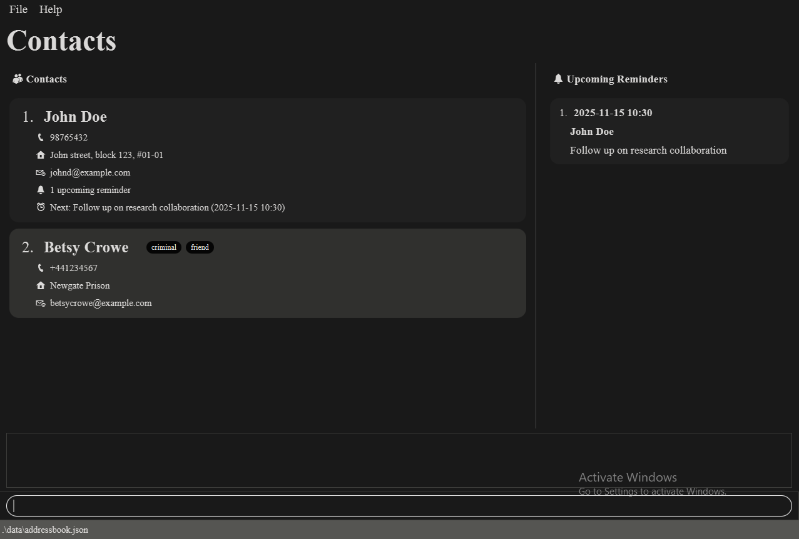
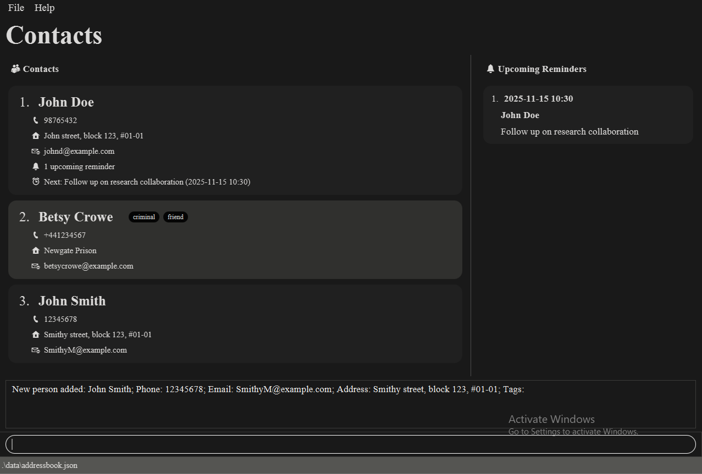
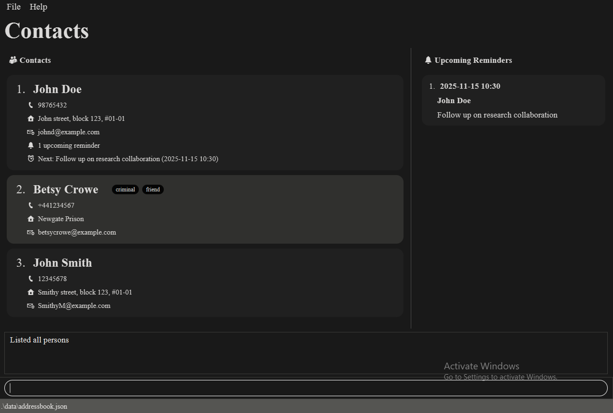
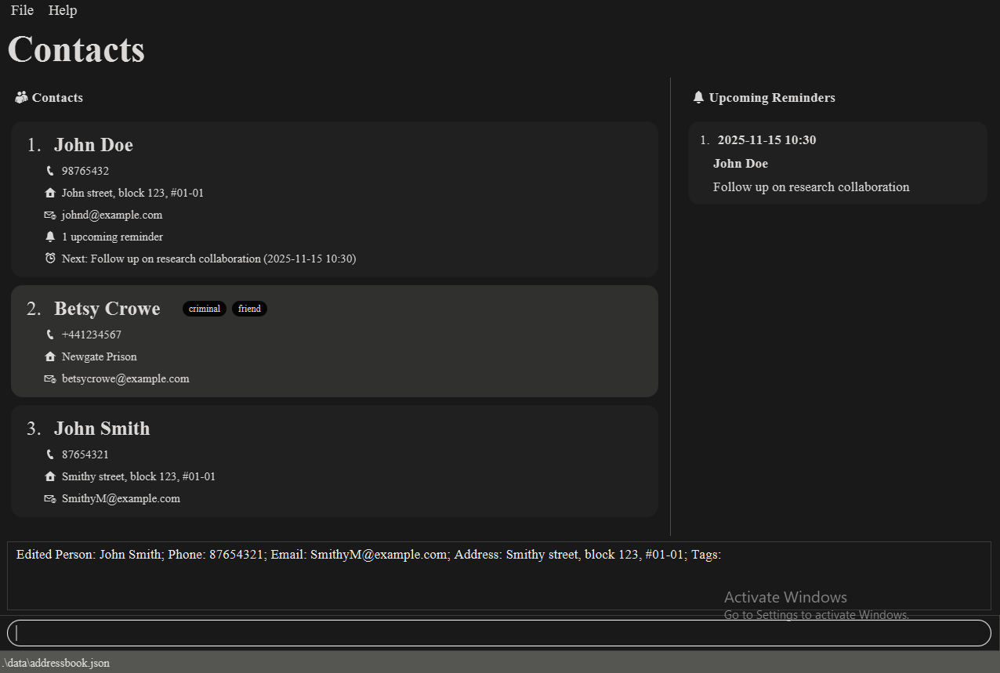
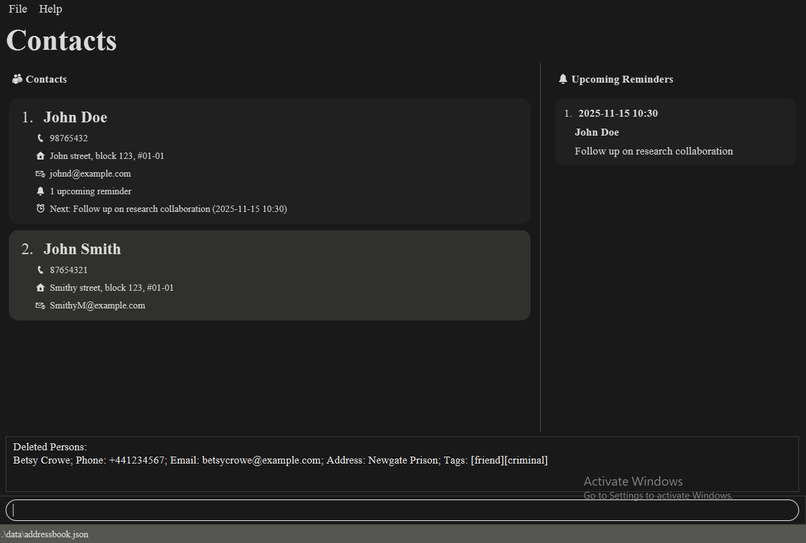
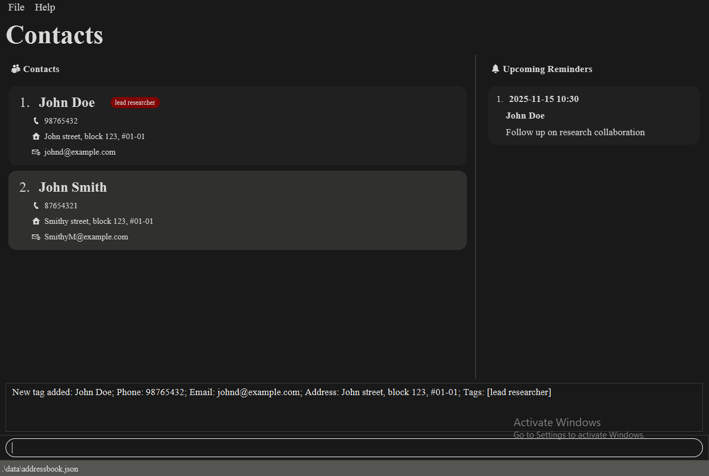
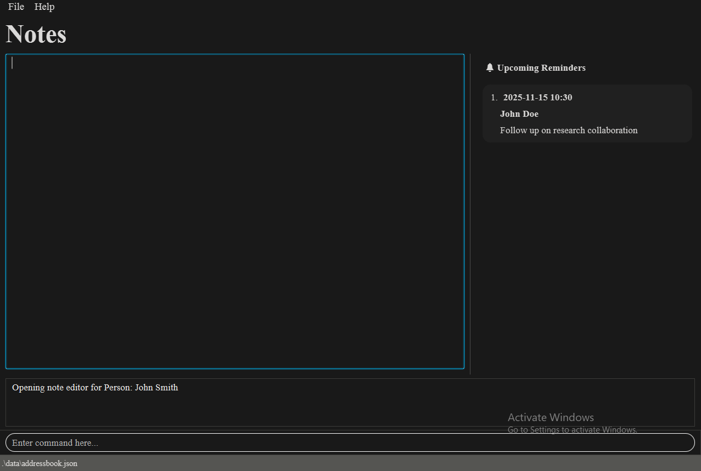
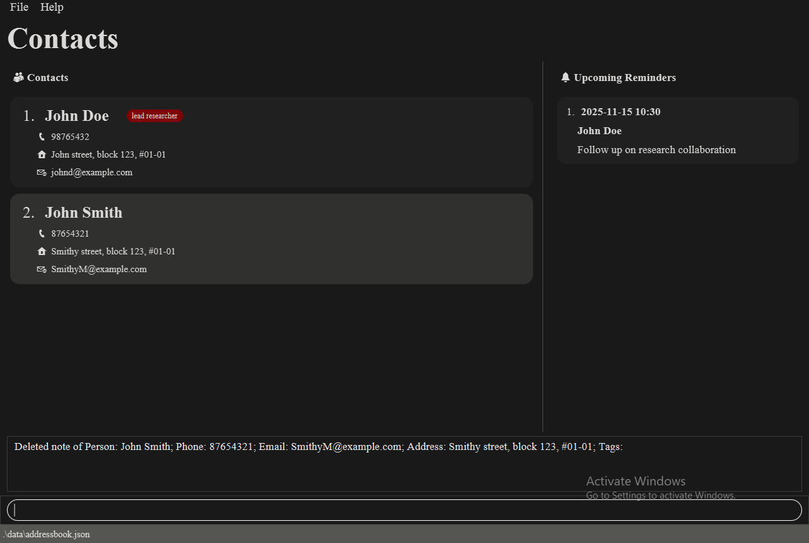
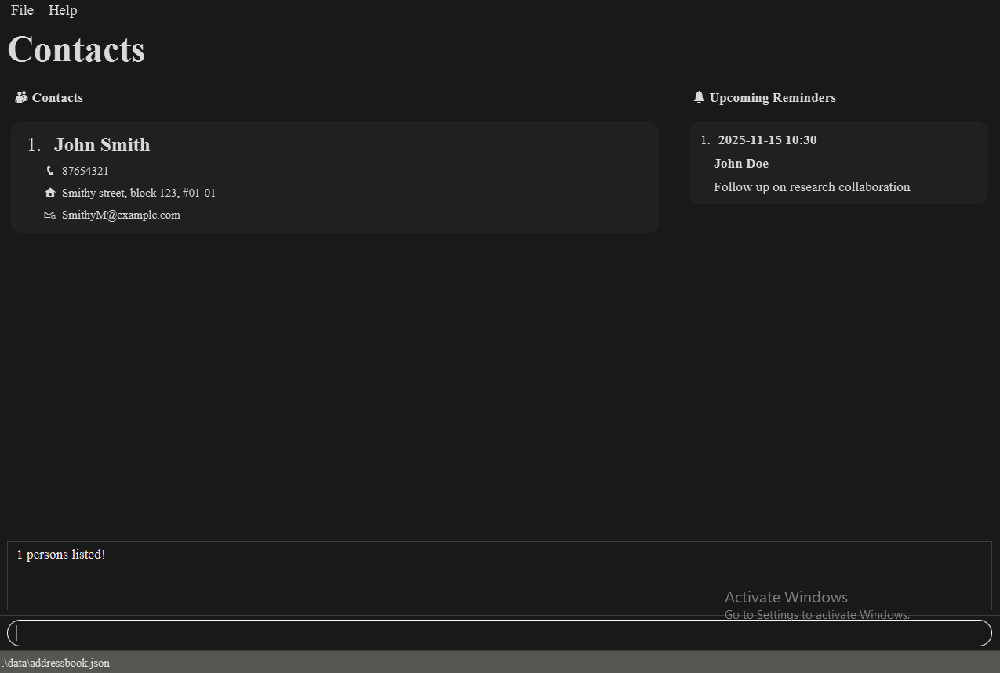
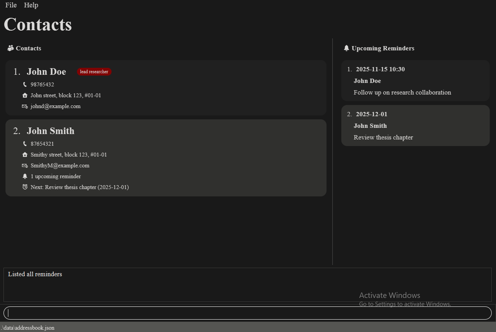

# AcademeConnect User Guide

# Table of Contents

- [Quick start](#quick-start)
- [Features](#features)
- [FAQ](#faq)
- [Known issues](#known-issues)
- [Command summary](#command-summary)

## Introduction

**_Purpose:_** This User Guide explains how to install, run and use AcademeConnect (AC) — a desktop contact manager
optimized for academic researchers who prefer a Command Line Interface (CLI) with an accompanying Graphical User
Interface (GUI).

**_Target users_**
- Graduate students, researchers, teaching assistants, and academics who manage contact/networks.
- Users who are comfortable with basic command-line operations (cd, java -jar) but prefer concise, repeatable CLI
  commands.

**_Assumptions about users_**
- Basic familiarity with Windows/macOS/Linux file navigation and opening a terminal.
- Java 17 (or newer) installed and available on the PATH.

**_How to use this guide_**
- A quick-start section shows installation and the shortest path to run the app.
- Features are organised by task with example commands and expected outputs.
- Use the page navigation at the top of the page to jump between sections. Hyperlinks are provided for direct
  navigation to commands.


--------------------------------------------------------------------------------------------------------------------


## Quick start

1. Ensure you have Java `17` or above installed on your computer.
    - Windows: Verify with `java -version` in PowerShell or Command Prompt. Expected output: `java version "17.0.x" ...`
    - macOS: follow the Java installation instructions [here]
      (https://se-education.org/guides/tutorials/javaInstallationMac.html).
    - Linux: Verify with `java -version`. Expected output: `java version "17.0.x" ...`

1. Download the latest `.jar` file (release) and save it to the folder you want to use as the _home folder_ for AC.

1. Open a command terminal, `cd` into the folder containing the jar file, and run:
   ```
   java -jar addressbook.jar
   ```
   Expected behaviour: A GUI window opens within a few seconds and the CLI input box is shown at the bottom of the
   window. Sample data may be present on first run.
   

1. Type commands into the command box and press Enter. Example:
    - `help` — opens the help window.
    - `list` — shows all contacts.
    - `add n/John Doe p/98765432 e/johnd@example.com a/NUS` — adds John Doe.
    - `exit` — exits the application.

### Tips

<div markdown="block" class="alert alert-info">

- Use the `list` command to confirm the index numbers before using index-based commands like `delete`, `edit`, `note`,
  `viewNote`, and `tag`.

- Copy multi-line example commands into a plain-text editor first if you find line-breaks get removed when copying from
  a PDF.
</div>

--------------------------------------------------------------------------------------------------------------------

## Features

<div markdown="block" class="alert alert-info">

**Notes about the command format:**<br>

* Words in `UPPER_CASE` are parameters. e.g. `add n/NAME` → `add n/John Doe`.<br>
* Square brackets `[...]` denote optional items.<br>
* An ellipsis `…` after an item indicates it can appear multiple times (including zero).<br>
* Extraneous parameters for no-argument commands (`help`, `list`, `exit`, `clear`) are ignored.<br>
* If you are using a PDF version of this document, be careful when copying and pasting commands that span multiple
  lines as space characters surrounding line-breaks may be omitted when copied over to the application.
</div>

<br>
<br>

## Feature List
**Basic**
- [Adding a person](#adding-a-person-add)
- [Listing all persons](#listing-all-persons-list)
- [Deleting a person](#deleting-a-person-delete)
- [Editing a person](#editing-a-person-edit)
- [Adding tags to a person](#adding-tags-to-a-person-tag)
- [Deleting tags from a person](#deleting-tags-from-a-person-tagdel)
- [Locating persons](#locating-persons-find)
- [Clearing all entries](#clearing-all-entries-clear)
- [Exiting the program](#exiting-the-program-exit)
- [Viewing help](#viewing-help-help)

**Notes**
- [Adding or updating a note](#adding-or-updating-a-note-note)
- [Viewing a note](#viewing-a-note-viewnote)
- [Deleting a note](#deleting-a-note-deletenote)

**Reminders**
- [Adding a reminder](#adding-a-reminder-reminder-add)
- [Listing upcoming reminders](#listing-upcoming-reminders-reminder-list)
- [Marking a reminder complete](#marking-a-reminder-as-complete-reminder-mark)


<br>
<br>

### Adding a person: `add`
Adds a person to the address book. <br>
**Format:** `add n/NAME [p/PHONE_NUMBER] [e/EMAIL] [a/ADDRESS] [t/TAG]…​` <br>

**Examples**:
```
add n/John                                #Adds a person with only a name
add n/John Doe p/98765432 e/johnd@example.com a/John street, block 123, #01-01
add n/Betsy Crowe t/friend e/betsycrowe@example.com a/Newgate Prison p/+441234567 t/criminal
add n/李明 p/+8613812345678               #Names can contain non-English characters
add n/Dr. Jane Smith-O'Connor            #Names can contain special characters
```

**Expected output on success:** `New person added: John Doe` <br>



**Notes:**
* Only the name field is required; all other fields are optional.
* The name can contain any characters (including special characters and numbers).
* Phone numbers can optionally start with a `+` for international numbers (e.g., `+6591234567`).

<br>
<br>

### Listing all persons: `list`
Shows a list of all persons in the address book.<br>
**Format:** `list` <br>
**Expected output on success:** `Listed all persons`



<br>
<br>

### Editing a person: `edit`
Edits an existing person in the address book.<br>
**Format:** `edit INDEX [n/NAME] [p/PHONE] [e/EMAIL] [a/ADDRESS] [t/TAG]…​`<br>

**Examples:**
```
edit 1 p/91234567 e/johndoe@example.com                 # Edits the phone number and email address of the 1st person to 
                                                        # be `91234567` and `johndoe@example.com` respectively.
                                          
edit 2 n/Betsy Crower t/                # Edits the name of the 2nd person to be `Betsy Crower` and clears all existing 
                                        # tags.
```

**Expected output on success:** `Edited Person: Johnathan Man; Phone: 87438807; Email: alexyeoh@example.com; Address:
Blk 30 Geylang Street 29, #06-40; Tags: [friends]` <br>



**Notes:**
* Edits the person at the specified `INDEX`. The index refers to the index number shown in the displayed person list.
* The index **must be a positive integer** 1, 2, 3, …​
* At least one of the optional fields must be provided.
* Existing values will be updated to the input values.
* When editing tags, the existing tags of the person will be removed i.e adding of tags is not cumulative.
* You can remove all the person’s tags by typing `t/` without specifying any tags after it.

<br>
<br>

### Deleting a person: `delete`

Deletes one or more persons from the address book.

**Format:** `delete [INDEX]...`

**Examples:**
```
delete 2                # deletes the 2nd person in the address book
delete 2 3              # deletes the 2nd and 3rd person in the address book
```

**Expected output on success:** `Deleted Persons: Roy Balakrishnan; Phone: 92624417; Email: royb@example.com; Address:
Blk 45 Aljunied Street 85, #11-31; Tags: [colleagues]`



**Notes:**
* Deletes the person at the specified `INDEX`.
* The index (or indexes) refers to the index number shown in the displayed person list.
* The index (or indexes) **must be a positive integer** 1, 2, 3, …​
* Duplicate indexes are ignored.
<br>
<br>

### Adding tags to a person: `tag`
Adds one or more tags to an existing person in the address book.<br>
You can choose to add research tags and title tags to reflect  your contacts' research topics or job titles. These tags
are displayed with a different colour than other tags.

**Format:** `tag INDEX t/TAG [t/MORE_TAGS]…​`<br>

**Examples:**
```
tag 1 t/friend                      # Adds the tag `friend` to the 1st person.
tag 1 jtt/lead researcher           # Adds the title tag 'lead researcher' to the 1st person.
tag 2 t/colleague t/cs2103t         # Adds both `colleague` and `cs2103t` tags to the 2nd person.
tag 2 rtt/AI                        # Adds the research tag 'AI' to the 2nd person. 
```

**Expected output on success:** `New tag added: Johnathan Man; Phone: 87438807; Email: alexyeoh@example.com; Address:
Blk 30 Geylang Street 29, #06-40; Tags: [classmates][friends]` <br>



**Notes:**
* Adds tag(s) to the person at the specified `INDEX`.
* The index refers to the index number shown in the displayed person list.
* The index **must be a positive integer** 1, 2, 3, …​
* Tags are added cumulatively - existing tags are preserved.
* Each normal tag must be a single word (no spaces allowed).
* You can add multiple tags in a single command.
* **Tag suggestions:** As you type after `t/`, the application will suggest existing tags that match your input. Press `Tab` to autocomplete the suggestion.

<br>
<br>

### Deleting tags from a person: `tagdel`
Deletes one or more tags from an existing person in the address book.<br>
You can delete specific tags or all tags of a certain type (research or title).

**Format:** `tagdel INDEX [t/TAG]…​`<br>

**Examples:**
```
tagdel 1 t/friend                     # Deletes the tag `friend` from the 1st person.
tagdel 2 t/colleague t/cs2103t        # Deletes both `colleague` and `cs2103t` tags from the 2nd person.
```

**Expected output on success:** `Tag(s) deleted: Johnathan Man; Phone: 87438807; Email: alexyeoh@example.com; Address:
Blk 30 Geylang Street 29, #06-40; Tags: [friends]` <br>

**Notes:**
* Deletes tag(s) from the person at the specified `INDEX`.
* The index refers to the index number shown in the displayed person list.
* The index **must be a positive integer** 1, 2, 3, …​
* You can delete multiple tags in a single command.

<br>
<br>

### Adding or updating a note: `note`
Opens a note editor for the person at the given index in the currently displayed list. The editor is a text box that 
replaces the person list. Use Esc to toggle back to the
command box, which automatically saves the note to storage.

See below for a sample image and exact behaviour of the editor.

**Format:** `note INDEX`<br>

**Examples:**
```
note 2              # opens the note editor for the 2nd person
```

**Expected output on success:** `Opening text editor for Person: John Doe`
<br>



**Behavior of note editor:**
- The command ```note INDEX``` opens the note editor, pre-populated with the person’s existing note (if any). After 
running the command, you will be focused on the editor (able to edit the note). 
- Press Esc to toggle between the command box and the note editor.
    - Pressing Esc while the editor is focused switches focus to the command box and saves the current editor content
      to disk. You can proceed to run other commands.
    - Pressing Esc while the command box is focused returns focus to the note editor. You can continue to edit the note.
- When focused on the command box, navigating away (for example, running ```list```) removes the text editor and 
returns the UI to the person list. The note saved will reflect the most recent update.

**Notes:**
* Editor supports text wrapping and vertical scrolling.
* Maximum note length: 5000 characters. Attempts to exceed this will be rejected by the editor.
* Opens the note editor of the person at the specified `INDEX`.
* The index refers to the index number shown in the displayed person list.
* The index **must be a positive integer** 1, 2, 3, …​

<br>
<br>

### Viewing a note: `viewNote`
Displays a person's note in the result area (read-only). Refer to 'note' command to edit.

**Format:** `viewNote INDEX`<br>

**Examples:**
```
viewNote 2              # displays note of the 2nd person
```

**Expected output on success:** `Note for John Doe: This is the note content`


**Notes:**
* Displays the note of the person at the specified `INDEX`.
* The index refers to the index number shown in the displayed person list.
* The index **must be a positive integer** 1, 2, 3, …​

<br>
<br>

### Deleting a note: `deleteNote`
Deletes a person's note.

**Format:** `deleteNote INDEX`<br>

**Examples:**
```
deleteNote 2                # deletes the note of the 2nd person
```

**Expected output on success:** `Deleted note of Person: John Doe`



**Notes:**
* Deletes the note of the person at the specified `INDEX`.
* The index refers to the index number shown in the displayed person list.
* The index **must be a positive integer** 1, 2, 3, …​
<br>
<br>

### Locating persons: `find`

You can choose between 3 search methods: by name, by tag, or by note content.<br>
Searching by name displays every person whose name contains any of the given keywords. <br>
Searching by tag displays every person who has been assigned any of the specified tags. <br>
Seaching by note displays every person whose note contains the search phrase.

**Format:** `find KEYWORD [MORE_KEYWORDS]` OR `find t/TAG_NAME [t/MORE_TAG_NAMES]` OR `find note/SEARCH_PHRASE`

**Examples:**
```
find John                       # returns `john` and `John Doe`
find alex david                 # returns `Alex Yeoh`, `David Li`
find t/friends                  # returns everyone tagged as `friends`
find t/friends t/colleagues     # returns everyone tagged as `friends` or `colleagues`
find note/Met at conference     # returns everyone who has the phrase "Met at conference" in their notes
```

**Expected output on success:** `2 persons listed!`



**Notes:**
* The search is case-insensitive. e.g `hans` will match `Hans`
* The order of the keywords does not matter. e.g. `Hans Bo` will match `Bo Hans`
* Only search by one of name, tag, or note
* Searching by tag is solely name-based. Searching by tags will match research tags or title tags with the same name
* For name and tag search, only full words will be matched e.g. `Han` will not match `Hans`
* Persons matching at least one keyword will be returned (i.e. `OR` search).
  e.g. `Hans Bo` will return `Hans Gruber`, `Bo Yang`

<br>
<br>


### Adding a reminder: `reminder add`

Adds a reminder for a person in the address book. Reminders help you track follow-ups, meetings, or important dates associated with your contacts. Added reminders automatically appear in the Upcoming Reminders panel on the right side of the application.

**Format:** `reminder add n/NAME d/DATE m/MESSAGE` OR `reminder add INDEX d/DATE m/MESSAGE`

**Examples:**
```
reminder add n/John Doe d/2025-11-15 10:30 m/Follow up on research collaboration
reminder add 1 d/15/11/2025 14:00 m/Coffee meeting at NUS
reminder add n/Jane Smith d/2025-12-01 m/Send conference paper draft
reminder add 2 d/1/12/2025 m/Review thesis chapter
```

**Expected output on success:** `New reminder added: John Doe; Date: 2025-11-15 10:30; Message: Follow up on research collaboration`


**Notes:**
* You can specify the person either by `n/NAME` (exact match required) or by `INDEX` from the displayed person list.
* The `INDEX` must be a positive integer 1, 2, 3, …​
* Date formats supported:
    * `yyyy-MM-dd HH:mm` (e.g., `2025-11-15 10:30`)
    * `dd/MM/yyyy HH:mm` (e.g., `15/11/2025 10:30`)
    * `yyyy-MM-dd` (e.g., `2025-11-15`) - defaults to end of day
    * `dd/MM/yyyy` (e.g., `15/11/2025`) - defaults to end of day
* Time is optional. If not provided, the reminder will default to the end of the day for the specified date.
* Only 24-hour time format is allowed.
* Messages can contain any text to describe the reminder purpose.
* Duplicate reminders (same person, date, and message) cannot be added.
* The application automatically displays upcoming reminders in the right panel, sorted by date.

<br>
<br>

### Listing upcoming reminders: `reminder list`

Displays all incomplete reminders that are upcoming in the Upcoming Reminders panel. This command is useful for refreshing the reminder view or checking all pending reminders at once.

**Format:** `reminder list`

**Expected output on success:** `Listed all upcoming reminders`



**Notes:**
* Shows all reminders that are:
    * Not marked as complete
    * Have a due date in the future or today
* Reminders are automatically sorted by date (earliest first)
* The Upcoming Reminders panel on the right side of the application always shows these reminders
* Use this command to refresh the reminder view if needed
* Completed reminders are hidden from this view - use `reminder mark INDEX` to mark reminders as complete

<br>
<br>

### Marking a reminder as complete: `reminder mark`

Marks a reminder as complete, removing it from the Upcoming Reminders panel. This helps you track which follow-ups 
you have already handled.

**Format:** `reminder mark INDEX`

**Examples:**
```
reminder mark 1                # marks the 1st reminder as complete
reminder mark 3                # marks the 3rd reminder as complete
```

**Expected output on success:** `Marked reminder as complete: John Doe; Date: 2025-11-15 10:30; Message: Follow up on research collaboration`


**Notes:**
* Marks the reminder at the specified `INDEX` as complete.
* The index refers to the index number shown in the Upcoming Reminders panel.
* The index **must be a positive integer** 1, 2, 3, …​
* Once marked as complete, the reminder will no longer appear in the Upcoming Reminders panel.

<br>
<br>

### Clearing all entries: `clear`

Clears all entries from the address book.

**Format:** `clear`


<div markdown="span" class="alert alert-warning">
This action is irreversible!
</div>

<br>
<br>

### Exiting the program: `exit`

Exits the program.

**Format:** `exit`

<br>
<br>

### Viewing help: `help`

Shows a message explaining how to access the help page.


Format: `help`

<br>
<br>

### Saving the data

Data is saved automatically after any command that modifies the address book. Data file location:
`[JAR file location]/data/addressbook.json`.

<div markdown="span" class="alert alert-warning">
Incorrect manual edits to `addressbook.json` may corrupt the file and cause data loss on next run. Back
up before editing.
</div>

<br>
<br>

### Editing the data file

AddressBook data are saved automatically as a JSON file `[JAR file location]/data/addressbook.json`. Advanced users are
welcome to update data directly by editing that data file.

<div markdown="span" class="alert alert-warning">
If your changes to the data file makes its format invalid, AddressBook will discard all data and start with an empty
data file at the next run.  Hence, it is recommended to take a backup of the file before editing it.<br>
Furthermore, certain edits can cause the AddressBook to behave in unexpected ways (e.g., if a value entered is outside
the acceptable range). Therefore, edit the data file only if you are confident that you can update it correctly.
</div>

<br>
<br>

### Archiving data files `[coming in v2.0]`

_Details coming soon ..._

<br>
<br>

--------------------------------------------------------------------------------------------------------------------

## FAQ

**Q**: How do I transfer my data to another Computer?<br>
**A**: Install the app in the other computer and overwrite the empty data file it creates with the file that contains
the data of your previous AddressBook home folder.

--------------------------------------------------------------------------------------------------------------------

## Known issues

1. **When using multiple screens**, if you move the application to a secondary screen, and later switch to using only
   the primary screen, the GUI will open off-screen. The remedy is to delete the `preferences.json` file created by the
   application before running the application again.
2. **If you minimize the Help Window** and then run the `help` command (or use the `Help` menu, or the keyboard
   shortcut `F1`) again, the original Help Window will remain minimized, and no new Help Window will appear. The remedy
   is to manually restore the minimized Help Window.

--------------------------------------------------------------------------------------------------------------------

## Command summary

| Action             | Format, Examples                                                                                                                                            |
|--------------------|-------------------------------------------------------------------------------------------------------------------------------------------------------------|
| **Add**            | `add n/NAME p/PHONE_NUMBER e/EMAIL a/ADDRESS [t/TAG]…` <br> e.g., `add n/James Ho p/22224444 e/jamesho@example.com a/123, Clementi Rd t/friend t/colleague` |
| **Clear**          | `clear`                                                                                                                                                     |
| **Delete**         | `delete INDEX [MORE_INDEXES]`<br> e.g., `delete 3`                                                                                                          |
| **Edit**           | `edit INDEX [n/NAME] [p/PHONE_NUMBER] [e/EMAIL] [a/ADDRESS] [t/TAG]…`<br> e.g.,`edit 2 n/James Lee e/jameslee@example.com`                                  |
| **Find**           | `find KEYWORD [MORE_KEYWORDS]`<br> e.g., `find James Jake`                                                                                                  |
| **List**           | `list`                                                                                                                                                      |
| **Help**           | `help`                                                                                                                                                      |
| **Tag**            | `tag INDEX t/TAG [t/MORE_TAGS]…`<br> e.g., `tag 1 t/friend t/colleague`                                                                                     |
| **Delete Tag**     | `tagdel INDEX t/TAG [t/MORE_TAGS]…`<br> e.g., `tagdel 1 t/friend t/colleague`                                                                               |
| **Note**           | `note INDEX`                                                                                                                                                |
| **View Note**      | `viewNote INDEX`                                                                                                                                            |
| **Delete Note**    | `deleteNote INDEX`                                                                                                                                          |
| **Add Reminder**   | `reminder add n/NAME d/DATE m/MESSAGE` OR `reminder add INDEX d/DATE m/MESSAGE`<br> e.g., `reminder add 1 d/2025-11-15 10:30 m/Follow up on project`        |
| **List Reminders** | `reminder list`                                                                                                                                             |
| **Mark Reminder**  | `reminder mark INDEX`<br> e.g., `reminder mark 1`                                                                                                           |
--------------------------------------------------------------------------------------------------------------------
